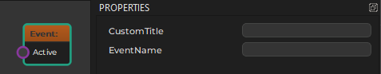

# Event Nodes

Event nodes are used to broadcast [event messages](world-messaging.md#event-messages) on the [game object](game-objects.md) on which the animation controller is running. This allows other code to react at the right moment to things like an animation being finished.

Event nodes allow you to broadcast custom events under exactly defined conditions. Additionally, every time an [animation clip](animation-clip-asset.md) is played, and actively contributes to the final pose, events that are defined on that clip will automatically be broadcast on the associated game object.

Note that the animation controller itself cannot *react* to events. For that purpose use [custom code](Code.md).

## Send Event Node

When this node is triggered, it broadcasts an `plMsgGenericEvent` with `Message` set to the value of `EventName`.

### Properties

* **EventName**: The string that is used as the `Message` property of the `plMsgGenericEvent` that is broadcast.

### Input Pins

* **Active**: While this pin is triggered, the message is sent (once every frame).

## See Also

* [Animation Controller](Animation-Controller.md)
* [Skeletal Animations](Skeletal-Animation.md)
