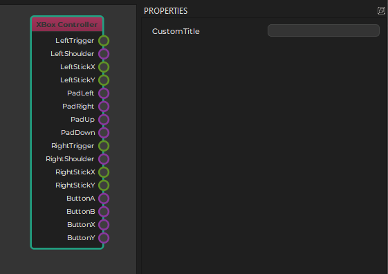

# Input Nodes

Input nodes expose the state of input devices to the animation controller. Input nodes are mainly provided for convenience during prototyping, as they may circumvent key mappings and general game state (e.g. whether the player is even allowed to move a character at all, at the moment).

For a proper game, it is better to use an [input component](../../../input/input-component.md) to forward input state to [custom code](../../../custom-code/custom-code-overview.md) and then decide their which animation shall get played. Then you can forward that state to the animation controller, through a [blackboard](../../../Miscellaneous/blackboards.md). The animation controller itself would retrieve what it shall do through the [blackboard nodes](anim-nodes-blackboard.md).

## XBox Controller Input Node

This node reads the raw state of the connected XBox controller 1. It then outputs the button states as trigger or number pins, depending on whether the respective button or stick provides an analog signal.

This node completely ignores any kind of button mapping. It is purely meant for prototyping scenarios, where it can be very convenient.

### Output Pins

* This node has one output pin for every button and stick direction. If you need to turn an analog signal into a trigger value, use the [Compare Number node](anim-nodes-logic-math.md).

## See Also

* [Animation Controller](Animation-Controller.md)
* [Skeletal Animations](Skeletal-Animation.md)
