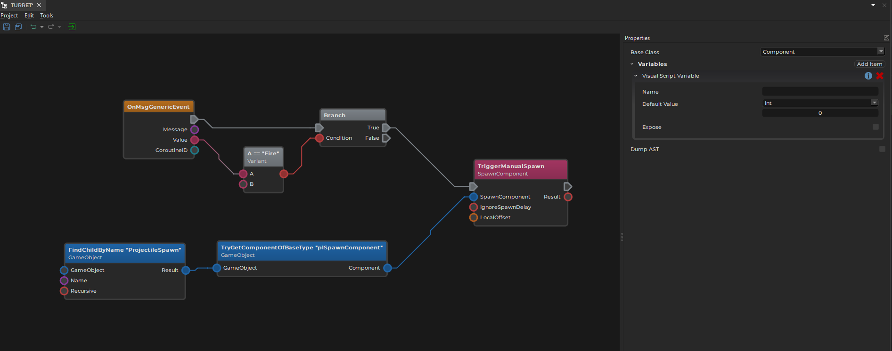
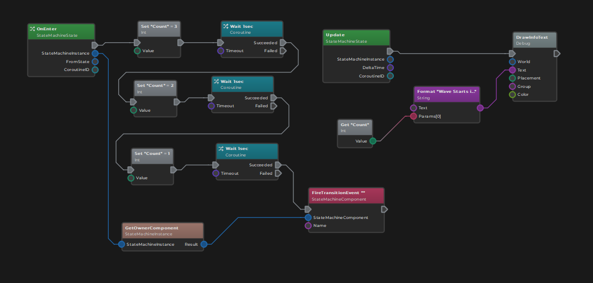
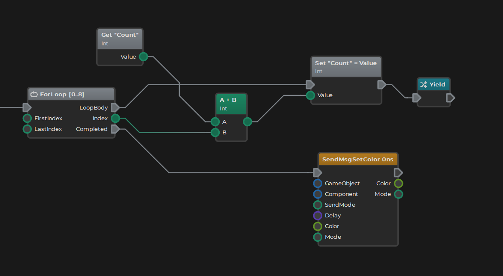

# Visual Script Class Asset

The *Visual Script Class* asset enables you to define custom logic for [components](../../runtime/world/components.md) and [state machines](../game-logic/state-machine-asset.md) using a visual programming language. Its intended use is to bridge the gap between what other components provide. For example a [trigger component](../../physics/jolt/actors/jolt-trigger-component.md) provides an event when something enters an area, and a [spawn component](../../gameplay/spawn-component.md) can spawn a [prefab](../../prefabs/prefabs-overview.md), however, to have a creature spawn in a room when the player enters it, you need something that connects the two. Visual scripts are a great way to accomplish this.

## Visual Script Editor

The image above shows the visual script editor layout. On the left is the graph editor where you can add and connect *nodes*. Right-click and drag to pan the view. Use the mouse wheel to zoom.

On the right is the *property panel* which shows the properties of the selected node. Node connections cannot be selected and don't have properties.

When nothing is selected, as in this case, the general script properties are displayed.

## Script Base Class

Deselect all nodes to see the script properties. The `Base Class` property defines in which scenario the script may be used.

### Base Class: Component

When *Component* is selected as the base class, the script acts like a component. Component specific functions like `Component::GetScriptOwner()` are only available with this base class.

These scripts are used in conjunction with the [script component](script-component.md) to execute them.

### Base Class: State Machine State

When *StateMachineState* is selected as the base class, the script acts like a custom state for a [state machine](../game-logic/state-machine-asset.md). In this case, different functions are available, such as `StateMachineState::GetScriptOwner()`.

These scripts are used in state machines through the [script state](../game-logic/state-machine-asset.md#script-state).

## Visual Script Variables

Through the general script properties you can add *variables* to your script. These may just be internal variables to keep track of state, but when the `Expose` flag is enabled, they become [exposed parameters](../../scenes/exposed-parameters.md). These variables will show up where the script is used (for example on [script components](script-component.md)) and allow you to pass in different starting values.

## Editing Visual Scripts

To build a visual script, right-click into the graph editor to open the context menu:

The menu shows all the available *nodes* that can be added. Type into the menu's header to search for specific items.

Nodes have *pins* on the left or right side with which they can be connected. The flow of execution and data goes from left to right. You connect pins via drag and drop. Every pin has a color-coded type. Not all pin types are compatible. Once you start dragging from a pin, all incompatible pins are greyed out and connections snap towards compatible pins. Depending on the target pin type, a data conversion may happen. For example, if a *number pin* is connected with a *string pin*, the number will be converted to text.

### Nodes

When you select a node, you will see its *properties* on the right.

When a node has *input pins* (pins on the left), it often also has properties for those pins. This is used for setting an input to a *constant value*, rather than passing it in through the pin. So when an input pin is unconnected, the script will use the value from the property grid.

Some nodes have additional configuration properties, that cannot be passed in through a pin, for example `GameObject::TryGetComponentOfBaseType()` where you have to select the desired base type.

### Execution Pins

Execution pins are the grey, arrow-shaped pins at the top of nodes. Not all nodes have them. These pins define the order in which nodes are executed. Only very few nodes have only an outgoing execution pin. These are *entry points* for the script, meaning they are where script execution starts. For instance, in the image at the top, the *Update* node is an entry point. Whenever the script gets *updated* (usually once every frame), this node gets executed. After that, the node that is connected to it through an *execution pin* gets executed. This continue until the last node in a chain was executed.

Some nodes have multiple outgoing execution pins, such as the `Switch` nodes. These nodes are used to conditionally execute one or another *code path*.

When a node has an incoming execution pin, it must be connected to something, otherwise the node can never be executed. However, nodes that do not have execution pins, at all, are executed *on demand* whenever their output is needed by another node that is being executed.

### Data Pins

All the round pins are *data pins* meaning they represent some kind of data. Many different types of data are supported. Numbers are generally convertible into other number types, and nearly everything can be converted to the string type, but most other types mostly exist to be passed unmodified from one node to another.

## Coroutines

The flow of execution starts at an *entry point* node and follows the execution pins to the right until the last node is reached. Usually this will happen within on script update and thus all nodes along the path are executed within the same game tick.

*Coroutines* allow you to pause execution at any point in the graph, and have the script continue there at a later time. Consequently, a script may have multiple *threads of execution*, meaning that there might be several execution paths active over a longer period of time.

Have a look at this script:

There are two *entry points*, the `OnEnter` node and the `Update` node. `OnEnter` is only executed once when the state machine state got activated. However, `Update` is executed once every game tick (every frame).

The `OnEnter` code path uses the `Wait` function. This turns the entire execution path into a *coroutine*. What this means is that when `Wait` is encountered, this execution path pauses for a second. After the wait is over, it continues from that point until it runs into the next `Wait` call.

> **Tip:**
>
> When an execution path uses coroutine functionality and thus may execute over a longer duration, the *entry point node* of that path shows an extra icon of two crossing arrows in its top left corner. See the `OnEnter` node in the image above and compare it to the `Update` node, which is not a coroutine.

In the mean time, the `Update` node is executed every frame. Thus when it runs, you already have two *threads of execution*, the one starting in the `Update` node which finishes right away, and the one that started from the `OnEnter` which is dormant for a time, but continues after a while.

Coroutines are a powerful and very convenient feature, as they make it possible to write code in a very linear fashion, even though there are complex, temporal dependencies.

A common use case for coroutines is to sequence AI tasks or quest objectives. For example one may instruct an NPC to walk to a position and then sit down. The command to walk somewhere is given through a node. But then an AI system has to calculate a path and steer the creature around obstacles to make it reach that point. None of this is part of the visual script, instead the *walkTo* node would be a coroutine node that pauses the script until the task is fulfilled or failed. On success the script would then run the next node to play the sit down animation. So the script is very simple, even though walking to a spot is a very complex operation.

### Coroutine Modes

When an *entry point* node gets executed that already spawn a thread of execution before, and that thread is not yet finished, there are three different ways to continue.

1. *Stop Other*: In this case, the existing coroutine gets canceled without notice. Use this mode when you always only want to react to the latest update. For example, you may have a coroutine that moves a creature to a picked location when the player clicks somewhere. Once the player clicks somewhere else, you would want the creature *only* to walk to the new target, and want to cancel the previous coroutine.

1. *Don't Create New*: In this mode you let an existing coroutine fully finish before starting a new one. For example a door would react to a button press by fully opening or closing and only react to another button press when the first action is over.

1. *Allow Overlap*: In this mode every single event would spawn a new coroutine, which all execute in parallel. For example a timer may fire once a second and every time you want to react to this by doing something complex, then you would use this mode to react to all events equally.

The coroutine mode is selectable on every *entry point* node.

### Advanced Coroutine Features

Every entry point provides a coroutine ID. This can be used to cancel a specific coroutine if needed. Similarly, there are functions to stop all coroutines or start separate ones. You can also use the `Yield` node to interrupt a script at a specific point and have it continue in the next frame.

## Loops

You can execute loops to iterate over data or repeat certain actions. Several different *loop nodes* are available. They all operate in the same way, that they have two outgoing *execution pins*. One execution pin is for the *loop body*. This execution path will be executed repeatedly until the loop is finished. Finally, the *completed* execution pin is executed to continue with the code that comes after the loop.

For example, the following script loops from 0 to 8 (inclusive) and for each iteration it adds the loop index to the counter variable. After the loop has been completed the execution flow continues at the *completed* pin, so a `SetColor` message is sent to the owner game object. Also note that the loop body contains a `Yield` statement so the loop is paused after every iteration and resumed the next frame (see the *coroutines* section above).

## Node Types

The following broad categories of nodes exist:

### Event Handlers

Event handlers are nodes that get executed when a certain [message](../../runtime/world/world-messaging.md) is sent to any of the objects that this script is responsible for. All event handlers are *entry points* into the script and most scripts will only execute as a reaction to an event.

### Blackboards

All the nodes for working with [blackboards](../../Miscellaneous/blackboards.md).

### Clock

There are two clocks, the *global clock* and the *world clock*. The global one always advances in real-time and should be used for animating things that are independent of the game speed. The world clock should be used for all game-play functionality that should slow down or speed up according to the game's speed, so that they work correctly in slow-motion.

### Component

Here you find all functionality shared by all [components](../../runtime/world/components.md) such as:

* `GetOwner`: Returns the components owner game object.
* `GetWorld`: Returns the world that the component belongs to.

Additionally, all component specific functionality can be found in the sub-menus.

### Coroutine

Here you find all functionality to work with coroutines, see [the coroutines section](#coroutines) above.

### Debug

These nodes are for [debug rendering](../../debugging/debug-rendering.md).

### Enums

These nodes are for working with enum values. There are two node types for each enum. The *value* nodes just return a fixed value and can be used to pass along. The *switch* nodes are used for reading an enum value and then executing a code path depending on the value.

### Game Object

[Game objects](../../runtime/world/game-objects.md) nodes are for reading and writing object transforms, finding and accessing child objects and components.

### Log

Nodes for [logging](../../debugging/logging.md).

### Logic

This group contains mathematical logic operators as well as conditions and loops. Very important nodes are:

* `Branch`: An `if` condition node with two possible outcomes.
* `Switch`: Several variants to map one value to multiple possible outcomes.
* `Compare`: Checks whether two values are equal, with a boolean result.
* `Is Valid`: Checks whether the incoming value, such as a game object or component, can still be used.

### Math

All sorts of mathematical operations for working with number types.

### Messages

While event handlers react to messages, the script can also *send messages* to other objects. Messages can be sent directly to a component, or to a game object, in which case they may be broadcast to all components on that object, or even to the whole sub-tree of objects and components. If the `Send Mode` is set to *Event*, however, they are delivered not downwards in the hierarchy, but *upwards* along the parent chain of the target object, to the closest component that handles this type of message. See [this chapter](../../runtime/world/world-messaging.md#event-messages) for details.

### Property

For reading and writing component properties.

### StateMachineInstance and StateMachineState

For interacting with [state machines](../game-logic/state-machine-asset.md). This is mainly necessary when the script itself is used as a *StateMachineState*. Be aware that the *state machine instance* in which the script is run, is passed into the script through the `OnEnter`, `OnExit` and `Update` nodes.

### String

For working with strings, e.g. to format a string by combining variable values.

### Time

For working with the *time* data type.

### Type Conversion

These nodes are for converting variables from one type to another. Especially important is the `ConvertTo` node, which is used for converting a *Variant* to an expected type. A *Variant* is a variable that can contain data of many different types. When a node returns a variant, you usually expect that it contains a certain type and using the `ConvertTo` node, you can get to it.

### Variable Nodes

These nodes operate on [visual script variables](#visual-script-variables). The variables have to be declared on the script first. Use these to keep track of state within the script and also to read state that was passed in through [exposed parameters](../../scenes/exposed-parameters.md).

### World

These nodes provide access to the [world](../../runtime/world/worlds.md), which is used for managing objects.

## See Also

* [Custom Code with Visual Scripts](visual-script-overview.md)
* [Script Component](script-component.md)