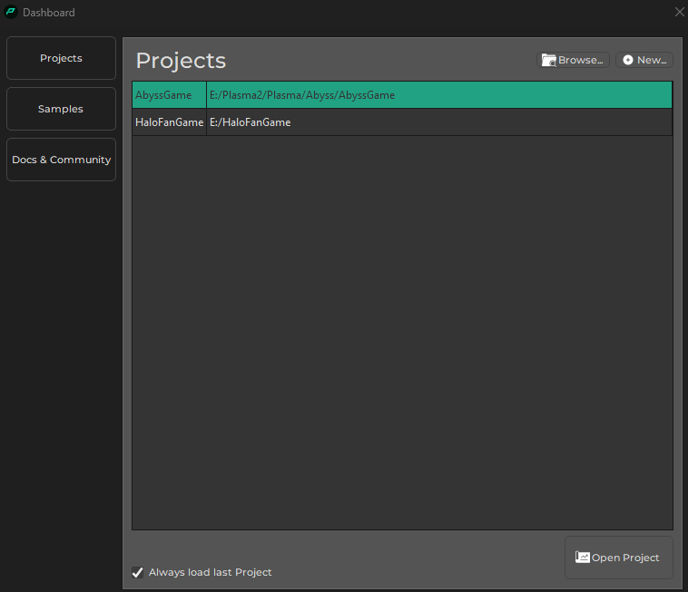
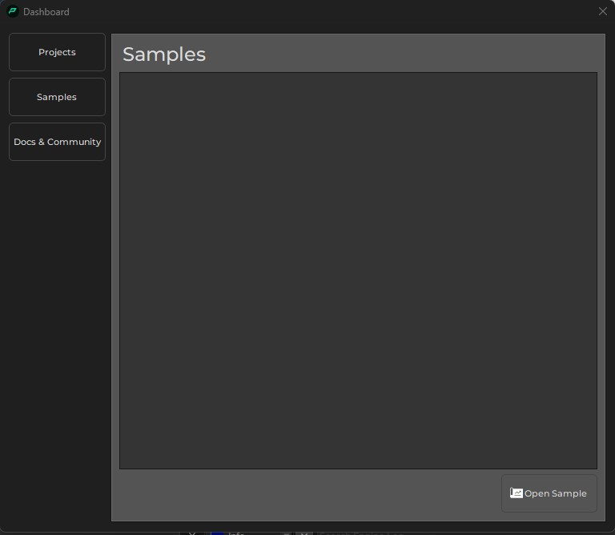

# Dashboard

The editor dashboard is a welcome screen that helps you getting started quickly. The buttons on the left-hand switch between the available options.

## Projects

On the projects page you can easily open a recently used [project](projects-overview.md). To create a new project, click the **New** button. To *open an existing project* that isn't shown in the list, click the **Browse...** button.

To open a project selected from the list, use the **Open Project** button or double click the list entry.

If you uncheck *Always load last project*, then the editor won't automatically open the project that you had open last time, when it starts up. Instead, it will always display the dashboard.

## Samples - TODO

## See Also

* [Projects](projects-overview.md)
