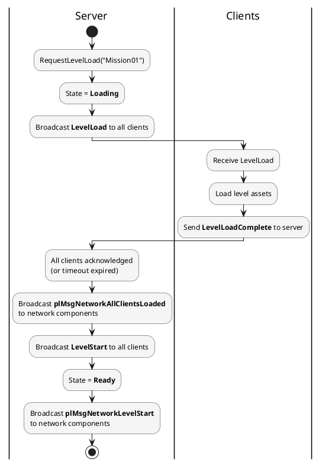

# Network Level Manager

The `plNetworkLevelManager` handles synchronized level loading across the server and all clients. It ensures all machines have loaded the same level before gameplay begins, with timeout handling and late-joiner support.

## Overview

When the server decides to load a level, all clients must load it before gameplay can start. The Level Manager coordinates this:

1. Server sends a `LevelLoad` message with the level path.
2. Each client loads the level and sends a `LevelLoadComplete` acknowledgment.
3. When all clients have acknowledged (or the timeout expires), the server sends `LevelStart`.
4. All machines begin gameplay simultaneously.

## Accessing the Manager

```c++
plNetworkLevelManager* pLevelMgr = pNetModule->GetLevelManager();
```

## Level States

| State | Description |
|-------|-------------|
| `None` | No level load in progress |
| `Loading` | Level load requested, waiting for client acknowledgments |
| `Ready` | All clients loaded (or timed out), level is playable |

## Server API

### Request Level Load

```c++
pLevelMgr->RequestLevelLoad(
  "Levels/Mission01.plScene",  // Level asset path
  30.0f);                       // Timeout in seconds (0 = no timeout)
```

This sends a `LevelLoad` message to all connected clients and transitions to the `Loading` state.

### Check Loading Status

```c++
plNetworkLevelState::Enum state = pLevelMgr->GetState();
const plString& levelPath = pLevelMgr->GetCurrentLevelPath();
bool bAllLoaded = pLevelMgr->AreAllClientsLoaded();
```

### Late-Joiner Sync

When a new client connects during or after a level load, sync the current level:

```c++
pLevelMgr->SyncLevelToClient(newClientID);
```

This is called automatically by the `plNetworkWorldModule` during the handshake process. The client receives the `LevelLoad` message, loads the level, sends its ack, and then receives `LevelStart` individually.

## Client API

### Handle Level Load

When a `LevelLoad` message arrives, the Level Manager broadcasts a `plMsgNetworkLevelLoadRequested` to all network components. Override the handler in your component to load the level and then notify completion:

```c++
void MyGameComponent::OnNetworkLevelLoadRequested(plMsgNetworkLevelLoadRequested& ref_msg) override
{
  // Load the level (async or sync)
  LoadLevel(ref_msg.m_sLevelPath);

  // When done, notify the server
  m_pNetworkModule->GetLevelManager()->NotifyLoadComplete();
}
```

### Handle Level Start

When the server signals all clients are loaded, a `plMsgNetworkLevelStart` is broadcast:

```c++
void MyGameComponent::OnNetworkLevelStart(plMsgNetworkLevelStart& ref_msg) override
{
  // All clients loaded -- begin gameplay
  StartGameplay();
}
```

## Timeout

If a client fails to acknowledge within the timeout period, the server proceeds with `LevelStart` anyway. This prevents a single slow or disconnected client from blocking everyone.

The timeout is specified per load request:

```c++
pLevelMgr->RequestLevelLoad("Levels/Mission01.plScene", 30.0f);
```

A timeout of `0.0f` disables the timeout (wait forever).

## Messages

All level events are delivered as `plMessage` types to `plNetworkComponent` subclasses:

| Message | Side | When Sent |
|---------|------|-----------|
| `plMsgNetworkLevelLoadRequested` | Client / Host | Server requests a level load |
| `plMsgNetworkLevelStart` | All | Server signals gameplay can begin |
| `plMsgNetworkAllClientsLoaded` | Server | All clients finished loading (before LevelStart) |

```c++
void MyGameComponent::OnNetworkAllClientsLoaded(plMsgNetworkAllClientsLoaded& ref_msg) override
{
  plLog::Info("All clients loaded! Starting gameplay...");
}
```

## Server-Side Flow



## Integration with Session

The [Network Session](network-session.md) integrates with the Level Manager automatically. When you call `pSession->StartGame("Mission01")`, it internally calls `RequestLevelLoad()` on the Level Manager and manages the state transitions.

## See Also

* [Network Session](network-session.md)
* [Network World Module](network-world-module.md)
