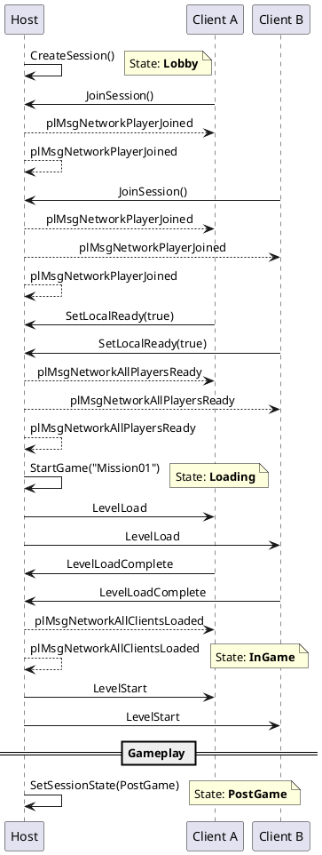

# Network Session

The `plNetworkSession` provides high-level session management for multiplayer games. It wraps the lower-level connection APIs and adds session concepts: lobby states, ready checks, player tracking, and lifecycle callbacks.

## Overview

A network session represents a multiplayer game from creation through gameplay to conclusion. The session manages:

* **Lifecycle states** -- Lobby, Loading, InGame, PostGame.
* **Player tracking** -- Who is connected and their ready state.
* **Game flow** -- The host starts the game when all players are ready, which triggers level loading.

## Accessing the Session

```c++
plNetworkSession* pSession = pNetModule->GetSession();
```

## Session States

| State | Description |
|-------|-------------|
| `None` | No session active |
| `Lobby` | Waiting for players, setting up the game |
| `Loading` | A level is being loaded across all machines |
| `InGame` | Gameplay is active |
| `PostGame` | Game is over (scoreboards, replays) |
| `Migrating` | Host migration in progress (reserved for future) |

## Creating and Joining

### As Host

```c++
plNetworkConfig config;
config.m_uiServerPort = 7777;
config.m_uiConnectionLimit = 8;

pSession->SetMaxPlayers(8);
pSession->CreateSession(config);  // Starts server and enters Lobby state
```

### As Client

```c++
plNetworkConfig config;
config.m_sServerAddress = "192.168.1.100";
config.m_uiServerPort = 7777;

pSession->JoinSession(config);  // Connects to server
```

### Leaving

```c++
pSession->LeaveSession();
```

## Ready State

Players can signal they are ready to start:

```c++
// Set local player's ready state
pSession->SetLocalReady(true);

// Check if a specific player is ready
bool bReady = pSession->IsPlayerReady(clientID);

// Check if all players are ready
bool bAllReady = pSession->AreAllPlayersReady();
```

The host tracks all ready states. On clients, `SetLocalReady()` sends the state to the server.

## Starting the Game

Only the session leader (the host) can start the game:

```c++
if (pSession->IsSessionLeader() && pSession->AreAllPlayersReady())
{
  pSession->StartGame("Levels/Mission01.plScene");
}
```

`StartGame()` transitions the session from `Lobby` to `Loading` and triggers level loading through the [Level Manager](network-level-manager.md). If no level path is provided, it simply transitions the state.

## Player Tracking

```c++
// Get all connected player client IDs
const plDynamicArray<plUInt32>& players = pSession->GetPlayerList();

// Get the player count
plUInt32 count = pSession->GetPlayerCount();

// Check if this machine is the host
bool bIsLeader = pSession->IsSessionLeader();
```

## Session Properties

```c++
pSession->SetMaxPlayers(16);
plUInt32 max = pSession->GetMaxPlayers();

pSession->SetSessionVisibility(true);   // Public session (for future matchmaking)
bool bPublic = pSession->IsPublicSession();
```

## Message Handlers

Session events are delivered as `plMessage` types to all registered `plNetworkComponent` subclasses. Override the virtual handlers in your component:

```c++
class MyLobbyComponent : public plNetworkComponent
{
  PL_DECLARE_COMPONENT_TYPE(MyLobbyComponent, plNetworkComponent, MyLobbyComponentManager);

  void OnNetworkPlayerJoined(plMsgNetworkPlayerJoined& ref_msg) override
  {
    plLog::Info("Player {} joined the session", ref_msg.m_uiClientID);
  }

  void OnNetworkPlayerLeft(plMsgNetworkPlayerLeft& ref_msg) override
  {
    plLog::Info("Player {} left the session", ref_msg.m_uiClientID);
  }

  void OnNetworkSessionStateChanged(plMsgNetworkSessionStateChanged& ref_msg) override
  {
    if (ref_msg.m_NewState == plNetworkSessionState::InGame)
    {
      // Start gameplay logic
    }
  }

  void OnNetworkAllPlayersReady(plMsgNetworkAllPlayersReady& ref_msg) override
  {
    plLog::Info("All players ready! Host can start the game.");
  }
};
```

These handlers are registered in the `plNetworkComponent` base class via `PL_MESSAGE_HANDLER`, so any subclass can override them without additional setup.

## Typical Flow



## See Also

* [Network Level Manager](network-level-manager.md)
* [Network World Module](network-world-module.md)
* [Getting Started Tutorial](networking-getting-started.md)
