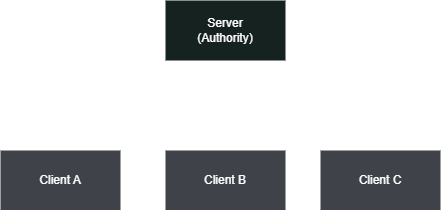

# Networking Overview

This page provides a comprehensive overview of the Plasma Engine networking architecture, core concepts, and how the subsystems fit together.

## Architecture

The networking plugin uses a **client-server** model. One machine acts as the *server* (or *host*), and all other machines connect as *clients*. The server is authoritative over the game state by default, though specific systems support owner-authoritative models for responsive player control.



### Roles

There are three connection roles, controlled by how you start the `plNetworkWorldModule`:

* **Server** -- A dedicated server with no local player. Starts with `StartServer()`.
* **Client** -- Connects to a remote server. Starts with `StartClient()`.
* **Host** -- Acts as both server and client simultaneously (listen server). Starts with `StartHost()`.

### Connection Flow

1. The server calls `StartServer()` which binds to the configured port.
2. Clients call `StartClient()` which initiates a connection to the server address.
3. A handshake exchange validates the protocol version and game version.
4. On success, the server assigns the client a unique **Client ID** and begins replicating existing world state.
5. The client receives spawn messages for all existing networked objects and their component states.

## Subsystem Overview

The `plNetworkWorldModule` is the central hub. It owns and provides access to all networking subsystems:

| Subsystem | Class | Purpose |
|-----------|-------|---------|
| [World Module](network-world-module.md) | `plNetworkWorldModule` | Connection management, tick loop, message routing |
| [Object Manager](network-object-manager.md) | `plNetworkObjectManager` | Spawn/despawn prefabs, ownership, pooling |
| [RPC Manager](network-rpc.md) | `plNetworkRpcManager` | Remote procedure calls with reflection |
| [Serializer](network-serialization.md) | `plNetworkSerializer` | Property replication with conditions |
| [Snapshot Interpolation](network-snapshot-interpolation.md) | `plNetworkInterpolator` | Smooth remote transform rendering |
| [Session](network-session.md) | `plNetworkSession` | Lobby, ready state, game flow |
| [Level Manager](network-level-manager.md) | `plNetworkLevelManager` | Synchronized level loading |
| [Network Time](network-world-module.md) | `plNetworkTime` | Clock synchronization |
| [Bandwidth Manager](network-world-module.md) | `plNetworkBandwidthManager` | Delta compression, priority scheduling |
| [Lag Compensation](network-world-module.md) | `plNetworkLagCompensation` | Server-side rewind for hit validation |

## Authority Models

The plugin supports two primary authority models. You choose per-object based on your game's requirements.

### Server Authoritative

The server has full control over an object's state. Clients send *inputs* or *requests* to the server (typically via RPCs), and the server updates the authoritative state, which is then replicated to all clients.

**Best for:** Combat, inventory, game rules, AI, anything where cheating prevention matters.

### Owner Authoritative

The owning client drives the object's state locally and replicates it to the server and other clients. The server may validate but does not override.

**Best for:** Player movement, camera, responsive local actions. The `plNetworkedTransformComponent` uses this model by default.

### Object Roles

Each networked object has a `plNetworkObjectRole` that describes its authority level:

* `OwnedAuthoritative` -- The owning client has full authority.
* `Replicated` -- The server has authority; clients receive read-only replicas.
* `ReplicatedSimulated` -- Like Replicated, but clients run local simulation (prediction) while still accepting server corrections.

## Message ID Ranges

Network messages are categorized into three ranges:

| Range | Purpose | Example |
|-------|---------|---------|
| 0 - 63 | Core protocol | Handshake, spawn/despawn, RPC, time sync, level management |
| 64 - 127 | Engine components | Transform state replication |
| 128 - 255 | User/game messages | Custom game-specific messages |

Game code should use message IDs starting at `plNetworkMessageIDs::UserMessageStart` (128) and register a callback via `SetUserMessageCallback()` on the world module.

## Replication Loop

Each network tick (default 60 Hz), the server performs the following:

1. **Process incoming messages** -- Handshakes, RPCs, client state updates, level acks.
2. **Update subsystems** -- Time sync, level manager, lag compensation.
3. **Replicate dirty components** -- For each component marked dirty (`MarkDirty()`), serialize its state and send to all relevant clients. Components with per-recipient properties (e.g., `OwnerOnly`) are serialized separately per client.
4. **Broadcast transform states** -- Transform components send their state at their configured send rate.

### Late-Joiner Synchronization

When a new client connects, the server automatically:

1. Sends spawn messages for all existing networked objects.
2. Sends the full component state of each object (`SyncComponentStatesToClient`).
3. If a level is loaded, sends the level load message and waits for the client's ack before sending `LevelStart`.

## Transport Layer

The plugin uses [ENet](http://enet.besra.com/) as its transport layer, providing:

* **Reliable ordered** -- Guaranteed delivery in order (RPCs, spawn/despawn).
* **Reliable unordered** -- Guaranteed delivery, may arrive out of order.
* **Unreliable ordered** -- May be lost, but always in order.
* **Unreliable** -- Fire-and-forget (frequent state updates where only the latest matters).

The transport is abstracted behind `plNetworkPeer`, so alternative drivers could be added in the future.

## Configuration

Network settings are configured through `plNetworkConfig`:

```c++
plNetworkConfig config;
config.m_sServerAddress = "127.0.0.1";  // Server IP
config.m_uiServerPort = 7777;           // Port
config.m_uiConnectionLimit = 32;        // Max connections
config.m_uiMessageSize = 1500;          // Max message size (bytes)
config.m_uiMessagePoolSize = 2048;      // Message pool size
```

Set the config before starting the network:

```c++
auto* pNetModule = pWorld->GetModule<plNetworkWorldModule>();
pNetModule->SetNetworkConfig(config);
pNetModule->StartServer();  // or StartClient() / StartHost()
```

## See Also

* [Network World Module](network-world-module.md)
* [Network Types](network-types.md)
* [Getting Started Tutorial](networking-getting-started.md)
