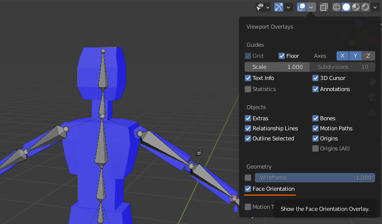
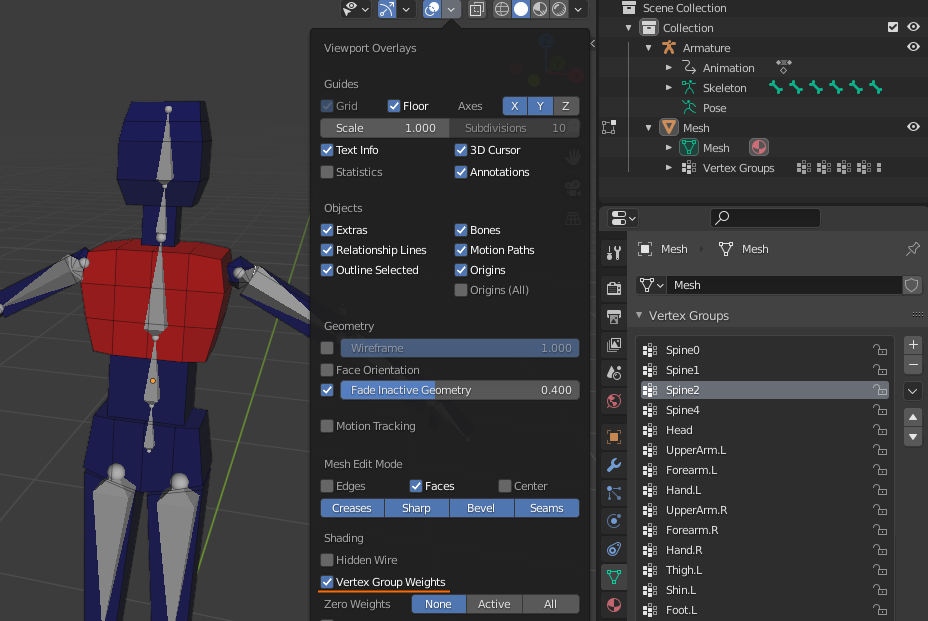
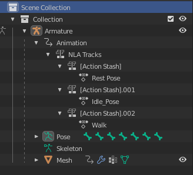
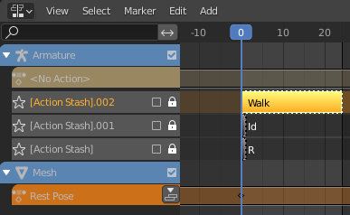
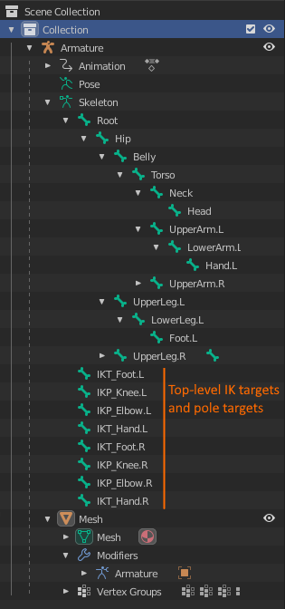
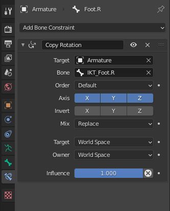

# Authoring and Exporting Animations with Blender

This page contains various pieces of information that are good to know when one uses Blender to build and export animated meshes. It is assumed that you know Blender well enough to create animated meshes.

## Exporting Animated Meshes

- To get animated meshes out of Blender and into Plasma Engine, export the animated mesh to a binary GLTF file (`.glb`).
- You can enable `+Y up` or not. In both cases you need to adjust the transformation on the [skeleton asset](skeleton-asset.md).
- Make sure that the GLTF export contains *Animations* and *Skinning* information.
- Don't disable animation sampling on export.
- Be aware that GLTF uses 1000 frames per second for all exported animation clips. Blender, by default, uses 24 frames per second. If you want to only use a sub-range of an animation in Plasma, you will need to re-calculate the frame indices accordingly. You can set Blender to use 25 or 50 frames per second to make this calculation easier.
- Enable `Export Deformation Bones Only` to strip IK pole targets and other unnecessary bones from the file.

## Importing Meshes into Plamsa

When importing a mesh, Plasma remaps the model space to its own convention. You may need to change the mapping, to get the desired result. For static meshes, this is configure on the [mesh asset](../../graphics/meshes/mesh-asset.md). For animated models, the mapping is chosen on the root node of the corresponding [skeleton asset](skeleton-asset.md).

Plasma uses the following convention:

- `+X` is the **forward axis**
- `+Y` is the **right axis**
- `+Z` is the **up axis**

By default all code uses `+X` as its main direction. For example AI nodes move characters *forwards* along the `+X` axis, spot lights and cameras "look" into the `+X` direction and so on.

In Blender it is common to have a character look along the `-Y` axis so that it faces the user when pressing `Numpad 1`. This also means that the right side of the character will be along the `-X` axis.

If you export such a mesh to a GLB and enable **Y UP** convention, you need to configure the mapping this way:

* Set `Right Dir` to **Negative X**
* Set `Up Dir` to **Positive Y**
* Set `FlipForwardDir` to **off**

## Authoring Meshes

1. Make sure all triangles face into the same direction. Use Blender's `Face Orientation` viewport option to see whether there are flipped triangles. If there are flipped triangles, they will show up incorrectly in Plasma.
    

## Authoring Animations

- Plasma only supports skeletal animations via skinned meshes. That means every vertex in the mesh needs to have a bone assigned via vertex weights. Blender can move entire objects through bone animations, but if they are only parented to a bone, and don't use vertex skinning (vertex weights),Plasma will not show those objects as animated. Use the *Vertex Group Weights* visualization in Blender to inspect which vertices are set up properly and which aren't.

    

- Plasma does not support scaling of bones. All bones must have scaling values of 1. If you have an object scaled in *object mode* and attached to a bone, the scaling will be represented by the bone, so even if your animation keyframes do not use scaling, the exported animation track  does. To fix this, select your scaled object and use *Mesh > Apply > Scaling* to bake the object scaling into the vertex positions and get rid of the scaling in the bone transforms.

- Plasma uses a maximum of 4 bones per vertex. By default Blender's GLTF export already restricts vertex weights to 4 bones, though there is an option to allow more influences. This won't have a positive effect in Plasma though.

- Be aware that Blender exports ALL keyframes of an animation. The preview window of an animation has no effect on the exported animation data.

- Blender always sets the first keyframe of all animations to index `1` and that is also how the data is exported. Plasma expects the first keyframe to be at index `0`, though. So set the animation range in Blender to start at index `0` and put the first keyframe there.

- Use the *Action Editor* in Blender to create and manage multiple animations in a single file. Be sure to set the *Fake User* flag on all of them to not lose any work.

- Now it gets weird: If you add multiple animations in Blender, usually 4 to 6 of them will be exported in the GLTF file. Once you add more animations, seemingly random ones won't be exported. This is because Blender thinks those animations are *unused* and won't export such unreferenced animations. The fix is to **fake reference every animation** in Blenders NLA editor. The way to do this, is to push the *Stash* button in the action editor on every animation.
 
You will then see this reference show up in the scene outline/hierarchy window.
 
**Don't rename the stashed item!** Every animation should be stashed only once, and if you keep the auto-generated name, Blender won't create another stash reference, if you push the stash button multiple times on the same animation. If you rename the item, that won't work anymore.

- To delete an animation that has been stashed (and thus referenced by the NLA editor), remove the *Fake User* flag and also open the NLA editor and delete any reference to the animation by pointing with the mouse on a track and pressing `X` or `Del`. 
 
Once no reference exists anymore, Blender removes the animation when you save and close the program.

### Animation Cycles

- To create an animation that can be repeated, such as walk cycles, the first and the last keyframe must be identical.
- Furthermore, Blender will typically use cubic interpolation between the keyframes. For the first and last keyframe this will result in an interpolation that slows down and speeds up and is therefore not smooth. The simplest solution is to set these (or all) keyframes to use *linear interpolation* instead.
- Another option is to insert duplicated dummy keyframes before the first and after the last keyframe, to force the desired interpolation, but then you need to configure the animation clip in Plasma to only use the proper sub-range of keyframes, which can be tricky to figure out.

### Rigging Meshes

There are many good tutorials how to rig meshes. However, here are some additional tips, some that are specific to using animated meshes in game engines.

- Make sure your mesh is rigged perfectly before you start animating. Even small adjustments to the rig later may require you to redo all your animations.

- Make sure that all bones are connected correctly to each other. For example, hand and foot bones MUST be connected to their respective arm and leg bones. You must not have any disconnected bones that would be connected in a real skeleton. Some tutorials suggest to disconnect hand and foot bones and use a *copy transform constraint* instead, when setting up IK in Blender. This is a really bad practice. It will appear to work at first, but once you use partial animation blending (for example to play an animation only on the upper or lower body), it won't work, because the disconnected bones are not part of the correct hierarchy. Similarly, setting up rag dolls for physics requires the bone hierarchy to be correct. Other engines have the same requirement. 
 

- If you want to add IK to your Blender rig, duplicate the desired bone (for instance the hand bone), then disconnect that bone from the hierarchy (making it a root bone), disable `Deformation` on that bone, and then use that as the IK target bone. Since `Deformation` is disabled, this bone won't be exported to GLTF either, which is what you want. It will only be a control bone. 
 

- If you want your actual hand bone to fully follow your IK target bone, add a `Copy Rotation Constraint` to it to have it follow both position and rotation animations that you add to the IK target bone. 
 

- You may also want to *hide* the original hand bone, such that you don't accidentally pick and animate it, when instead you want to animate the IK target bone (which will most of the time be in the exact same location).

- Be aware though, that once a bone is hidden, it is quite a pain to make any modifications to it, because Blender won't allow you to select it anymore, not even from the outliner tree view. Instead you must *unhide the bone first*. Either unhide everything (using `ALT+H`) or unhide only the desired bone through its context menu in the outliner pane.

- For IK bones, make sure your pole targets really work correctly. Most tutorials mention that you need to use a rotation offset of +90, -90 or 180 degree, but I have also observed the need for 45 degrees (and consequently 135 degrees) etc. The best way to check is to toggle between *Edit Mode* and *Pose Mode* (with the rest pose active) and check that bones with IK don't have extreme twist in pose mode. The bones should only slightly move to fulfill their IK configuration, but if for example arm bones twist by a large amount, then your pole target configuration isn't correct.

- If you seem to not get the pole target configuration correct, first make sure the target joint has a slight bend (for instance an elbow shouldn't be fully straight). Then remove the IK constraint on the bone entirely and set it up from scratch. Blender seems to have internal state that can't be fixed differently.

## See Also

* [Skeletal Animations](skeletal-animation-overview.md)
