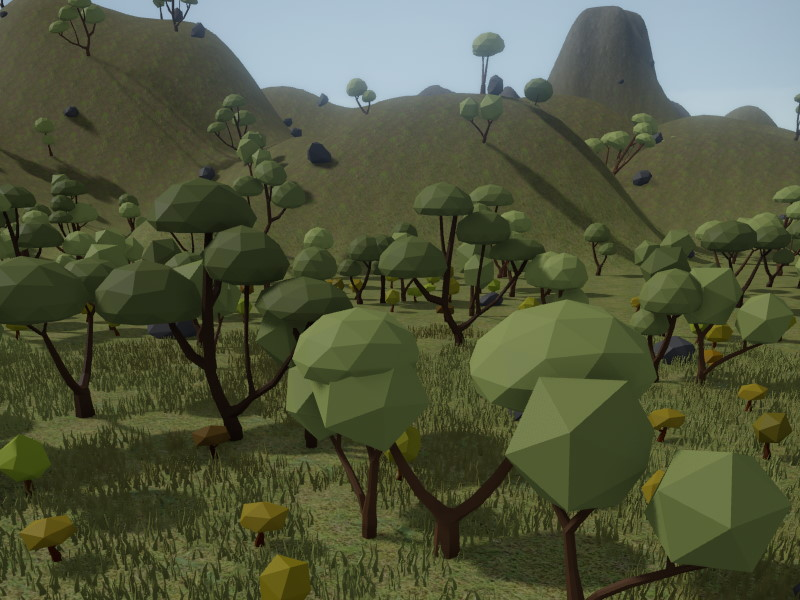

# Procedural Object Placement

Creating large terrain with convincing vegetation is a lot of work. Since nature generally follows certain rules, such as on which type of terrain which plant can grow, how densely they are packed and so on, it makes sense to rather build and apply such rules to automatically place objects, than attempting to place vegetation by hand.

Plasma comes with a *procedural generation* feature. This is designed specifically for decorating terrain with vegetation, but can also be used in other scenarios.

The system is heavily inspired by the procedural vegetation system in *Horizon Zero Dawn*. See this GDC talk ([video](https://www.youtube.com/watch?v=ToCozpl1sYY), [slides](https://www.gdcvault.com/play/1024700/GPU-Based-Run-Time-Procedural)) for reference.

## Technical Overview

The procedural generation system is active in a scene once a [procedural placement component](procgen-placement-component.md) is added to it. The component defines in which area a certain rule is used to place objects. The rules are set up through [ProcGen graph assets](procgen-graph-asset.md). The rules specify which objects to place under which conditions and with what kind of variation.

Additional components can be placed to affect the object placement in select areas, such as for clearing an area or increasing the density of a certain type of plant.

The procedural placement system only places objects during scene simulation, so without pressing *play* in the editor, you won't see any placement.

The system uses the position of the main [camera](../../graphics/camera-component.md) to determine where to place objects. Object placement is distributed across frames, to prevent stutter. A grid around the camera is used to determine in which area objects have been placed already. When the camera moves, new cells will be populated, and cells that are too far away are cleared again. This way the system makes sure that there is a relatively constant performance impact.

Consequently, procedurally placed objects can't have state that needs to be persistent. Each object can have state, for example you could make it place trees that can be burned down, but it must be fine for your game, that the tree will reappear, if the player gets far away and returns.

Object placement is deterministic. As long as the placement rules and the conditions (terrain, materials, etc) don't change, the same object will be placed at the same position every single time.

## See Also

* [ProcGen Graph Asset](procgen-graph-asset.md)
* [Procedural Placement Component](procgen-placement-component.md)
