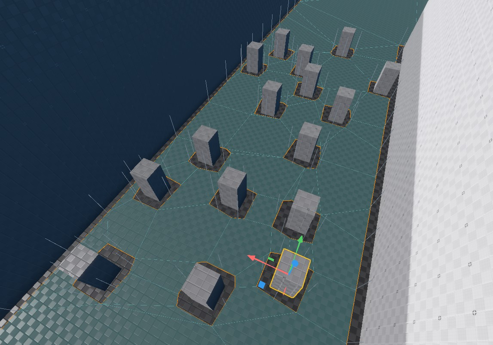

# Recast Navmesh

Navmeshes are special meshes that define which areas of a scene are traversable for an AI agent. Though they can also be used to restrict player movement, for example in games where falling down a ledge should not be possible.

To add a navmesh to a scene, place a [navmesh component](recast-navmesh-component.md) to an entity.

Navmeshes are unique to each scene, therefore they are not treated as reusable assets. Instead, each navmesh component generates and holds the data directly. Since generating a navmesh can take a long time, this process is exposed as an [editor background operation](../editor/editor-bg-operations.md).

To update a navmesh, open the background operations panel and start the corresponding operation.

To visualize the navmesh, enable the `ShowNavMesh` option on the navmesh component.

## Navmesh Generation Options

The options that affect navmesh generation are available through the [navmesh component](recast-navmesh-component.md).

## Using the Navmesh

Currently the navmesh functionality is only usable directly through custom C++ code. The AI components that are available are not in a state where they are usable, but their code can be used for inspiration. You will need to write your own code and use the Recast/Detour functionality directly to implement agent steering or other features.

The navmesh component registers its navmesh in the `plRecastWorldModule`. You can then retrieve the scene's navmesh through `plRecastWorldModule::GetNavMeshResource()`. From their on you can use Recast to plan a path, check whether a location is walkable, and so on.

Be aware that the Recast integration is very basic. Any help improving it would be highly appreciated.

## See Also

* [Recast Navmesh Component](recast-navmesh-component.md)
* [Recast Integration (TODO)](recast.md)
