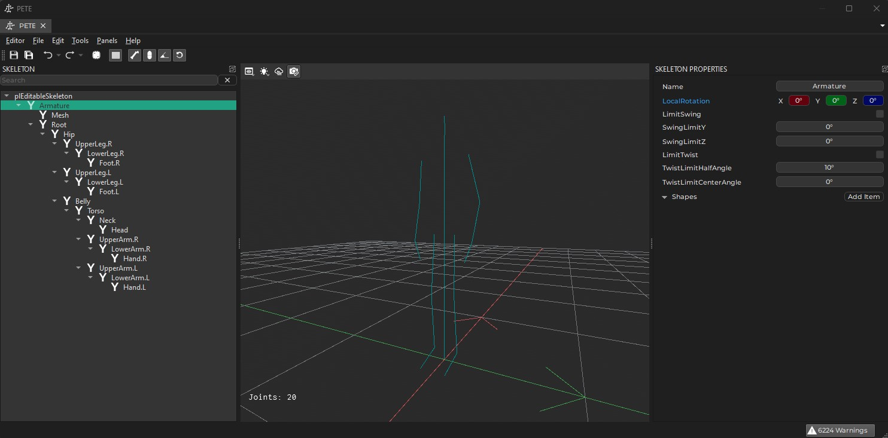

# Skeleton Asset

The main function of the *Skeleton asset* is to store information about the bone hierarchy in an [animated mesh](animated-mesh-asset.md). Here you adjust the overall scale and rotation of imported animated meshes.

In the future the skeleton asset will also be used to define physics shapes for bones for collision detection and ragdolls. This is currently not yet implemented, though.

## Asset Properties

* `File`: The file from which to import the skeleton information. This is typically the same file as in the [animated mesh asset](animated-mesh-asset.md).

* `RightDir`, `UpDir`, `FlipForwardDir`: These properties are the same as on the [mesh asset](../../graphics/meshes/mesh-asset.md#asset-properties). Depending on how the mesh was exported, you may need to adjust these to have the skeleton (and every mesh that uses this skeleton) stand upright and look into the correct direction.

  In Blender it is common to model meshes such that they face the user when the front view is active (`Numpad 1`):

  

  With such an orientation the *right* side of the model points into the *-X* direction. The *+Z* axis corresponds to the *up* direction and the model looks into the *+Y* direction. When you export such a model to GLTF/GLB, you can keep this convention (*Y up* disabled in the export settings) or you can export it in the more common convention of using +Y as the *up* axis (*Y up* enabled). Both conventions can be mapped to PLASMA's preferred convention like so:

  For GLB files exported from Blender with *Y up* use:
  * `RightDir` = `Negative X`
  * `UpDir` = `Positive Y`
  * `FlipForward` = `off`

  For GLB files exported from Blender with *Z up* use:
  * `RightDir` = `Negative X`
  * `UpDir` = `Positive Z`
  * `FlipForward` = `off`

  Note that inPlasmathe convention is that models look along the **+X** axis. Every component (such as AI) assumes that moving along the +X axis will move the mesh *forward*, moving along +Y moves it to the *right* and moving along +Z moves it *upwards*. It is therefore best to import all meshes this way right away.

* `UniformScale`: The overall size of the skeleton. Use this if you need to adjust from centimeters to meters.

* `BoneDirection`: This setting only affects the visualization of the skeleton. It has no effect on the actual mesh skinning. It is used to tell the visualizer which cardinal direction the bones should point into. You only need to change this setting, if the skeleton visualization looks all wrong (all lines point into weird directions). You need to *transform* the asset to apply the change. Just try all options until it looks right.

## See Also

* [Skeletal Animations](skeletal-animation-overview.md)
* [Animated Mesh Asset](animated-mesh-asset.md)
* [Skeleton Component](skeleton-component.md)
